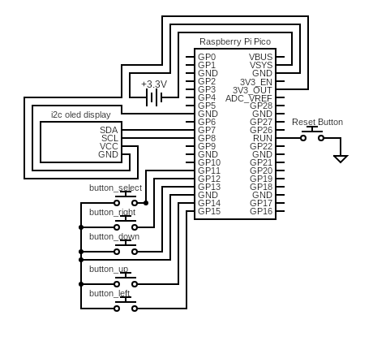

# Crokinole-Score-Keeper
battery powered Crokinole score keeper using the raspberry pi pico

here is the current circuit that i am using this code for

there is currently directional input buttons and one select button.

there is a separate reset button that is hardwired to the RUN pin. if you ground the RUN pin, it causes a reset to occur.

